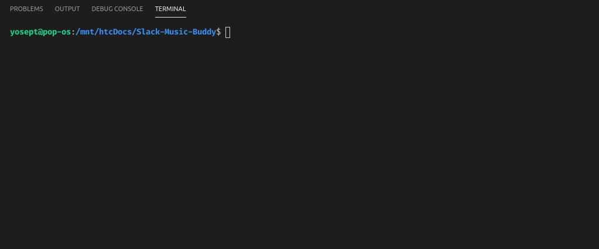

<dl>
  <div class="headerWrapper" style="display:flex;flex-direction:column;align-items:center;margin:25px 0; text-align:center">

<h1>Your friendly neighbor, who knows a little bit too much about music</h1>
</div>
  </dl>

# Navigation
- ### [Test it yourself](#yourself)
- ### [Test it locally](#locally)
  - #### [Clone it](#clone)
  - #### [Install dependencies it](#install)
  - #### [Add you .env if necesary](#env)
  - #### [Run the bot](#run)
- ### [Run command](#runc)
- ### [Slack commands](#slackc)
  - ### [Youtube](#yt)
  - ### [Spotify](#sp)
  - ### [Help](#hp)
- ### [Notes](#nt)

---

## <a id="yourself"></a>Test it yourself
You can join the [**Example Inc. slack server**](https://join.slack.com/t/example-inc-hq/shared_invite/enQtODkyODYzMTE5OTU4LTdkYTgxZmVjNzY2MWJhMWY5NjRlZDJmMjdkOWNmMjI0N2M1ZDc5NGIyNjY0YzEwYmIyMGU2NmYzNDU4ODk4NzY) to test the bot yourself without downloading anything!!!

(Keep in mind the bot is hosted on a free heroku account, so it sleeps 6 hours a day, from 12am to 6am timezone -6)

---
## <a id="locally"></a>Test it locally

- [ ] <a id="clone"></a>**First:** Clone the github repo to your machine

```
$ git clone git@github.com:YoseptF/Slack-Music-Buddy.git
```

- [ ] <a id="install"></a>**Install the dependencies:** This project uses some gems, you can check what they are in `Gemfile`, to install them use:
```
$ bundle install
```

> ## <a id="env"></a>****Important! before run it****
> 
> Remember adding your own .env before runnning the bot locally, if you are > hosting it on heroku, change the env variables on the site too
> 
> this is a example of how your .env should look like (or if you're > reviewing the project you can contact me on slack to save some time ;3):
> ```
> SLACK_API_TOKEN=YOUR_API
> YOUTUBE_API=YOUR_API
> SPOTIFY_API=YOUR_API
> ```
> If you need your own API keys, you can get them here:
> - [Slack](https://api.slack.com/apps)
> - [Youtube](https://console.developers.google.com/)
> - [Spotify](https://developer.spotify.com/dashboard/applications)
> 
> .

- [ ] <a id="run"></a>**Then:** Open a terminal inside your folder an run
```
$ rake deploy:run
```
You should look a message like this:


AND THAT'S IT, you can go to the channel now and invite the bot :D

---
## <a id="runc"></a>run command
  `rake deploy:run` or
  `heroku run rake deploy:run`
---
## <a id="slackc"></a>Commands on slack
---
### Invite the bot to your channel


---
### <a id="yt"></a>Youtube
  `youtube + search`


---
### <a id="sp"></a>Spotify
  `spotify + search`


---
### <a id="hp"></a>help
  `@Music Buddy help`


---
### <a id="nt"></a>Notes
remember to run `dotenv rspec` intead of only `rspec` when testing, since Rspec and the inner commands require ENV variables to work
