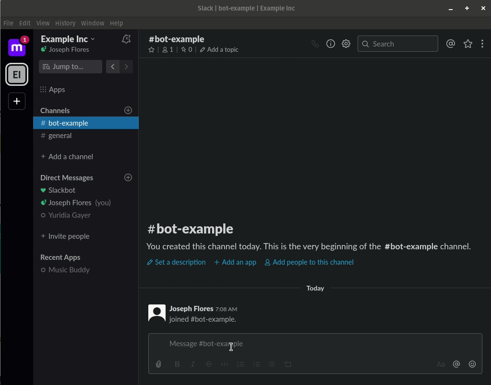
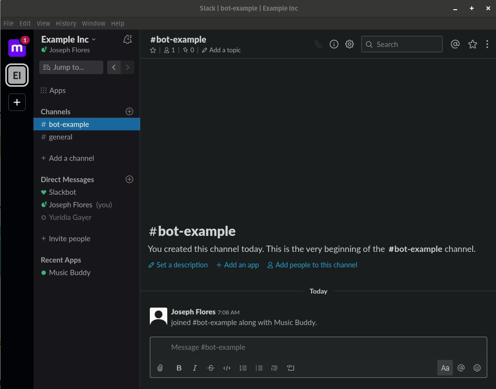

<dl>
  

<h1>Your friendly neighbor, who knows a little bit too much about music</h1>

  </dl>

## Before running
Remember adding your own .env before runnning the bot locally, if you are hosting it on heroku, change the env variables on the site too

## run command
  `rake deploy:run` or
  `heroku run rake deploy:run`
---
## Commands on slack
---
### Invite the bot to your channel

---
### Youtube
  `youtube + search`

---
### Spotify
  `spotify + search`

---
### help
  `@Music Buddy help`

---
### Notes
remember to run `dotenv rspec` intead of only `rspec` when testing, since Rspec and the inner commands require ENV variables to work
